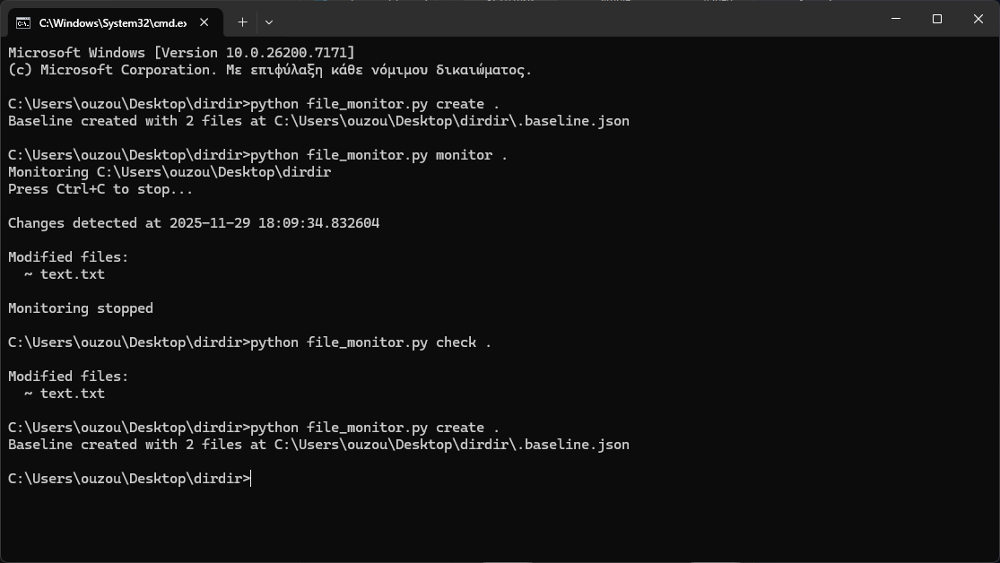

# HashWatch - Integrity Scanner

## ✨ Introduction
HashVault a modular, security‑first Python application for baseline creation and integrity monitoring of files and directories. It detects new, modified,
moved, copied, and deleted files using `SHA256 hashing`, `metadata analysis`, and `inode/fileID tracking`. Thus, it works both for Unix and Windows systems. Built to
demonstrate modular coding architecture, secure programming practices, and practical monitoring in real‑world environments. This project served as a means for me
to gain experience in Python development, secure coding, and cybersecurity in general.

##### 🔖 **Keywords**: `Python` `Integrity Monitoring` `Hashing` `Baseline` `Detection` `Logging` `Security` `Modularity`

## 🔐 Key Features
- Baseline creation with `baseline.json` metadata snapshot
- `SHA256` hashing with chunked file reads for scalability
- Detection of new, modified, moved, copied, and deleted files
- Real‑time monitoring with configurable interval
- Modular design with `FileInfo` abstraction and error handling

## 🛠️ Tech Stack
- Python
- Standard Libraries (os, hashlib, json, time, datetime)
- Modular architecture with reusable classes

## 📸 Screenshots
### HashWatch capabilities


### Baseline.json


## 📁 Structure
- `file_monitor.py`: Main script with CLI commands (create, check, monitor)
- `FileInfo class`: Handles hashing, metadata extraction, and inode/fileID logic
- `Baseline JSON`: Stores file metadata for integrity comparison

## 📖 How to Use
1. Create a baseline
```bash
python hashwatch.py create <directory>
```
This creates the `baseline.json` with metadata for all files inside the directory.

2. You may check for changes once
```bash
python hashwatch.py check <directory>
```
This compares the currect state of each file with the baseline and shows any changes.

3. Continuous monitoring
```bash
python hashwatch.py monitor <directory> [interval in seconds // default is 60]
```
4. Stop the monitoring with `Ctrl+C`
